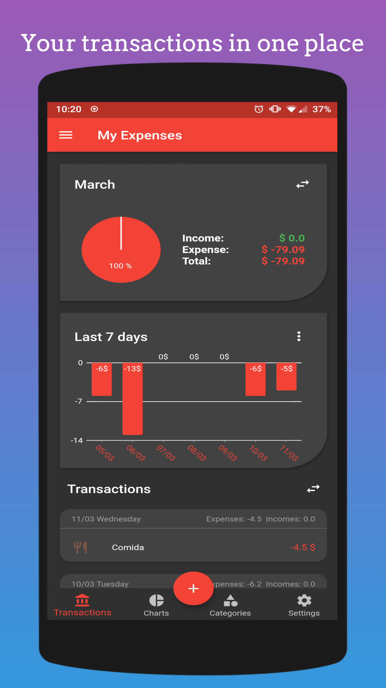
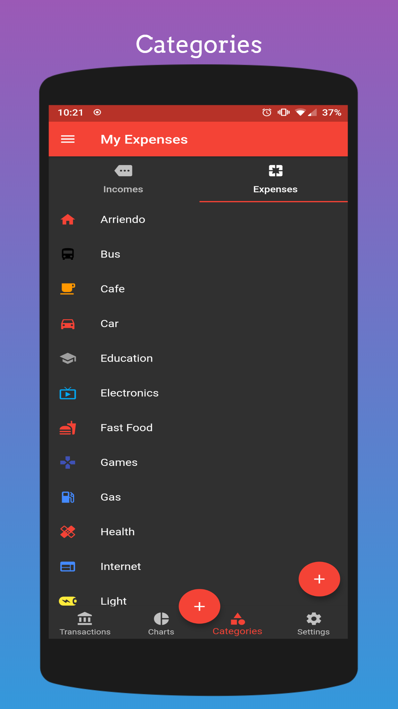
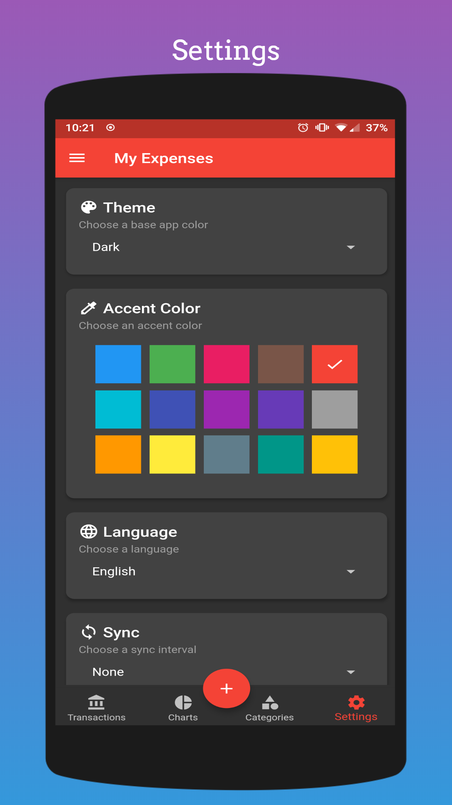
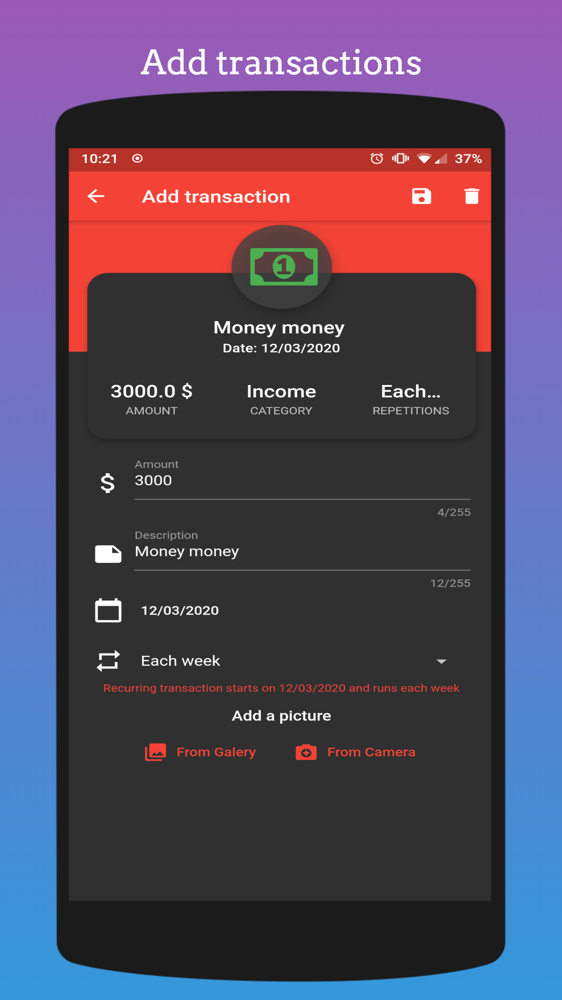

<h1 align="center">My Expenses</h1>
<p align="center">
  
</p>

An app that helps you to keep track of your expenses

### Screenshots

<p align="center">
  
  
</p>

<p align="center">
  
  
</p>

<p align="center">
  
</p>

### Features
- Recurring Transactions
- Charts
- Reports
- Categories
- Themes
- And more

### Installation
#### Android
[](https://play.google.com/store/apps/details?id=com.miraisoft.notes)

### Support
If you have any bug report, suggestion, feature request, etc, please go into the [Issues section](https://github.com/Wolfteam/MyExpenses/issues) and create a new issue. 
>**Note**: I'm looking for a new app icon, if you would like to donate one i won't stop you :D**

### Donations
I hope you are enjoying using this app, If you would like to support my work by buying me a coffee / beer, please send me an email

### Building / Debugging
Inside the lib folder, create a class called "Secrets" like the following:
````
class Secrets {
  static String appCenterKey = 'your_app_center_key_goes_here';
}
````

Inside the android folder, create a file called key.properties, and add the following to it (**this is only required if you want a release build**):
````
storePassword=your_pass
keyPassword=your_pass
keyAlias=your_alias
storeFile=C:/path/to_your/keystore/your.keystore
````

To generate the app bundle, just: 
````
flutter build appbundle
````

To generate the apks from the appbundle (**First download the jar bundletool**):
````
java -jar bundletool.jar build-apks --bundle=your_app.aab --output=myexpenses.apks --ks=your.keystore --ks-pass=pass:your_pass --ks-key-alias=your_alias --key-pass=pass:your_pass
````

And finally, to install the .apk:
````
java -jar bundletool.jar install-apks --apks=myexpenses.apks
````
