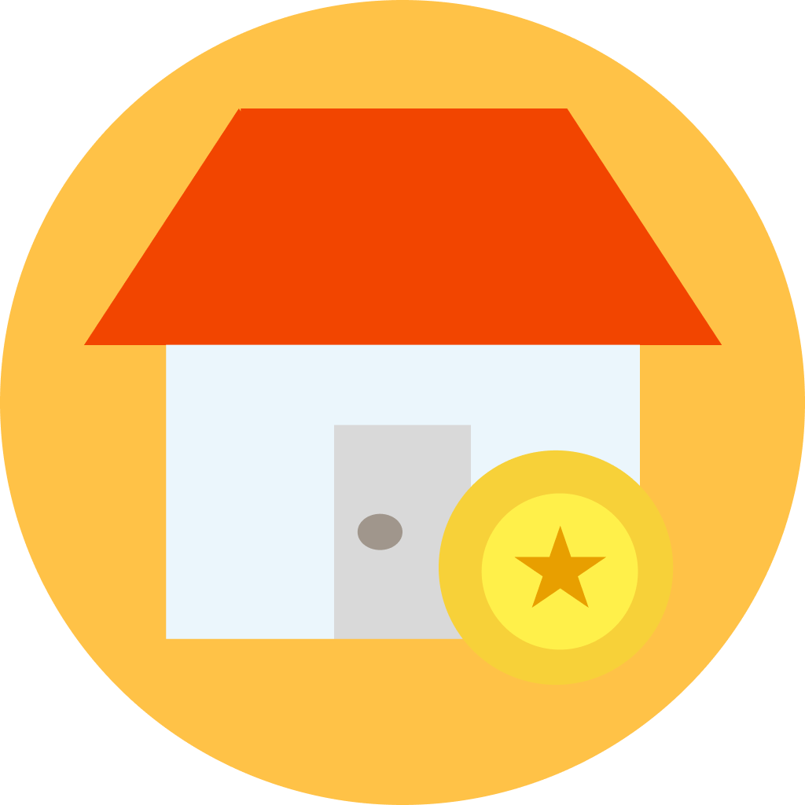
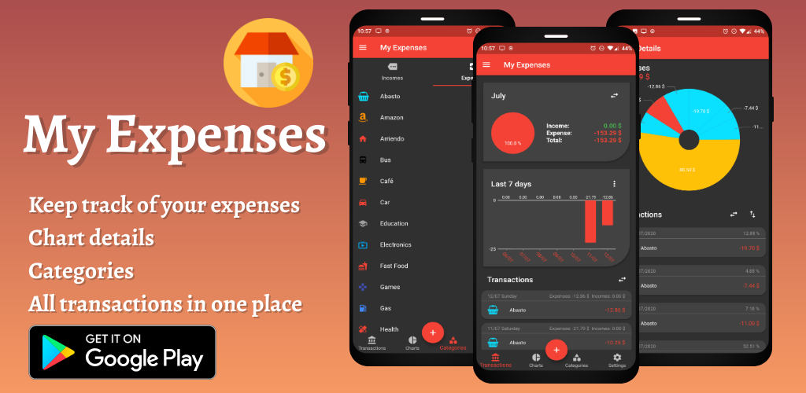
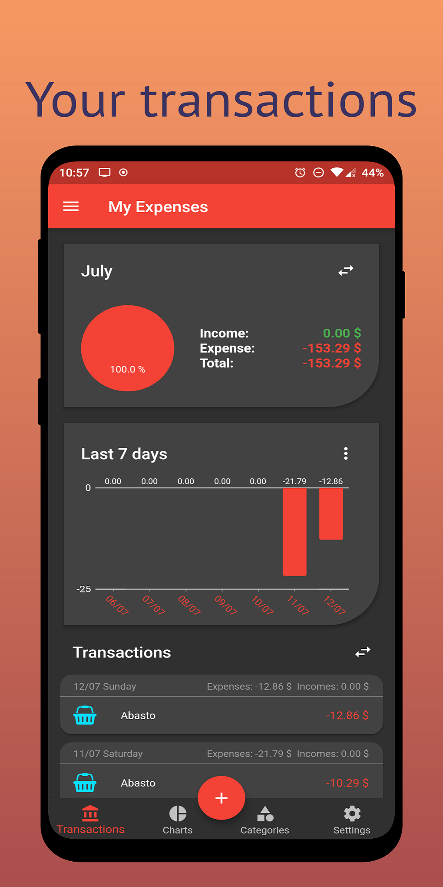
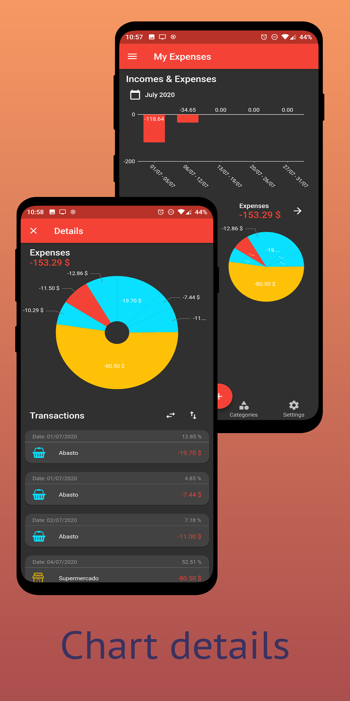
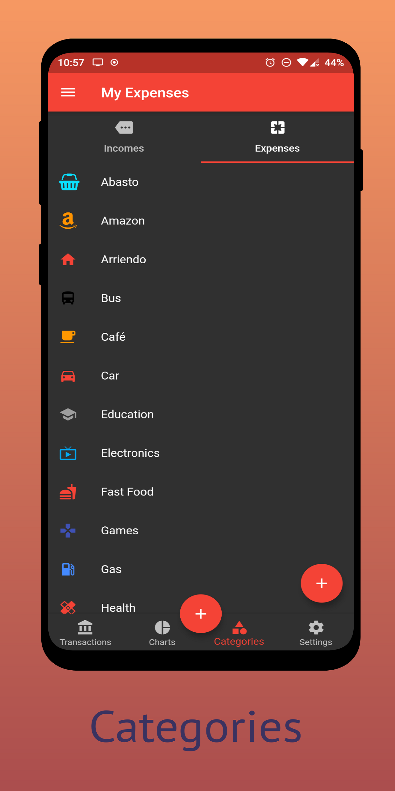
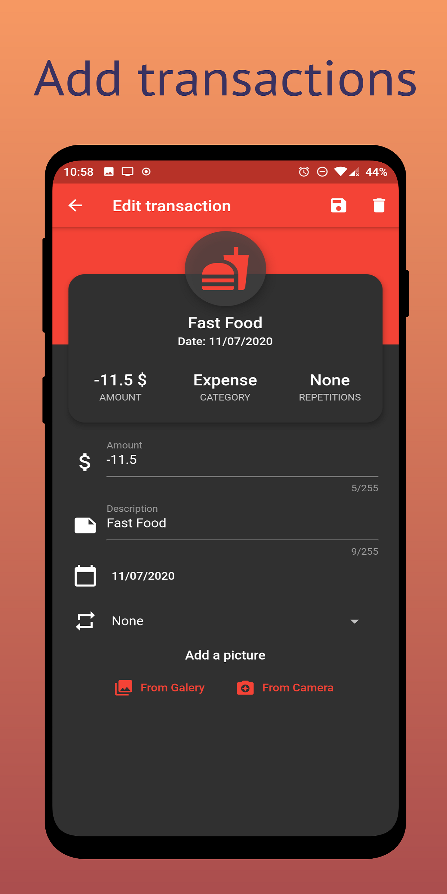
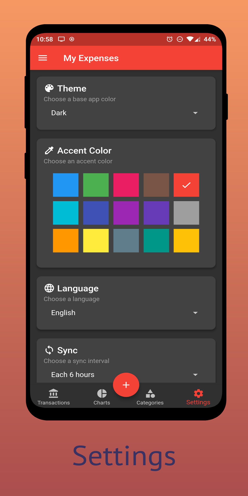

<h1 align="center">My Expenses</h1>
<p align="center">
  
</p>

> An app that helps you to keep track of your expenses

<p align="center">
  
</p>

### Screenshots

<p align="center">
  
  
</p>

<p align="center">
  
  
  
</p>


### Features
- Recurring Transactions
- Charts
- Reports
- Categories
- Themes
- And more

### Installation
#### Android
[](https://play.google.com/store/apps/details?id=com.miraisoft.my_expenses)

### Support
If you have any bug report, suggestion, feature request, etc, please go into the [Issues section](https://github.com/Wolfteam/MyExpenses/issues) and create a new issue.
>**Note**: I'm looking for a new app icon, if you would like to donate one i won't stop you :D**

---

### Donations
I hope you are enjoying using this app, If you would like to support my work by buying me a coffee / beer, please send me an email

---

### Architecture

This app follows **Clean Architecture** with the **BLoC** pattern across four layers:

| Layer | Location | Responsibility |
|-------|----------|----------------|
| Domain | `lib/domain/` | Models, abstract DAOs, service interfaces. No Flutter or infrastructure dependencies. |
| Application | `lib/application/` | BLoC state management. One BLoC per feature/screen concern. |
| Infrastructure | `lib/infrastructure/` | Drift DAOs, concrete service implementations, SQLite database. |
| Presentation | `lib/presentation/` | Flutter UI widgets, organized by feature. |

Dependency injection is registered in `lib/injection.dart` using **GetIt**.

---

### Development Environment

This project uses **FVM** (Flutter Version Manager). All Flutter and Dart commands must be prefixed with `fvm`:

```sh
fvm flutter pub get
fvm flutter run
fvm flutter test
fvm dart run build_runner build --delete-conflicting-outputs
```

---

### Code Generation

Several packages require code generation. Run after modifying any of the following:

| Trigger | Command |
|---------|---------|
| `freezed` models (`*.freezed.dart`) | `fvm dart run build_runner build --delete-conflicting-outputs` |
| Drift database schema changes | `fvm dart run build_runner build --delete-conflicting-outputs` |
| `json_serializable` models | `fvm dart run build_runner build --delete-conflicting-outputs` |
| Localization strings in `l10n/` | `fvm dart run intl_utils:generate` |

---

### Adding a New Feature

Follow this order to stay consistent with the existing architecture:

1. Add domain model(s) in `lib/domain/models/`
2. Add abstract DAO in `lib/domain/` (if the feature is database-backed)
3. Implement Drift DAO in `lib/infrastructure/db/`
4. Register services, DAOs, and BLoCs in `lib/injection.dart`
5. Create BLoC(s) in `lib/application/`
6. Build UI screens and widgets in `lib/presentation/`
7. Run `build_runner` if any models or schema changed

---

### Database

The app uses **Drift** (SQLite ORM). The schema is defined in `lib/infrastructure/db/database.dart`. DAOs are split by entity (categories, transactions, payment methods, users).

After any schema change, regenerate code:

```sh
fvm dart run build_runner build --delete-conflicting-outputs
```

---

### Localization

Strings live in `lib/l10n/`. The app uses `intl_utils` for code generation.

- Access strings in widgets: `S.of(context).yourKey`
- After adding new keys, regenerate: `fvm dart run intl_utils:generate`

---